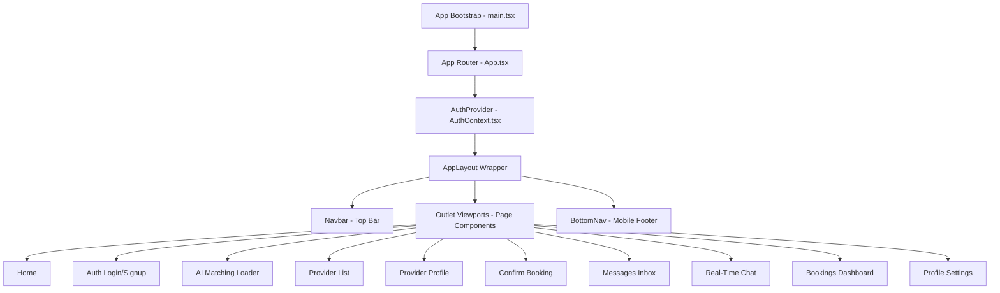

# Architecture & Structural Documentation: Khidmat (خدمت)

This document provides a comprehensive technical breakdown of the **Khidmat** on-demand services marketplace, detailing the frontend architecture, backend setup, database structures, AI integration engines, and data flow.

---

## 🎨 1. Frontend Architecture & Components

The frontend is built as a single-page application (SPA) using React 19, Vite, TypeScript, Tailwind CSS v4, and Framer Motion.



### 🛣️ Routing & Route Connections (`src/App.tsx`)
The app uses React Router for page transitions:
1.  **`/` (Home)**: Search bar (with Speech Recognition) and category grid selection.
2.  **`/auth` (Auth)**: Handles login, registration, and location coordinate selection.
3.  **`/matching` (AI Matching)**: Shows the AI scanning radar and processes searches.
4.  **`/providers` (Provider List)**: Lists ranked providers with travel fee details and AI pricing estimates.
5.  **`/provider/:id` (Provider Profile)**: Displays biography, pricing, reviews, and tier awards.
6.  **`/booking` (Confirm Booking)**: Form to schedule appointments, calculate distance, and finalize prices.
7.  **`/inbox` (Inbox)**: Dedicated messaging dashboard listing active conversation logs.
8.  **`/chat` (Chat)**: Real-time chat dialogue screen between customers and providers.
9.  **`/bookings` (Bookings)**: Dashboard listing active and history bookings. Allows customers to submit reviews.
10. **`/profile` (Profile)**: Displays profile metrics, business statistics, and sign out controls.

### 🧩 Core Component Roles
*   **`Navbar.tsx`**: Top header. Displays availability state controls for service providers (`ONLINE` vs `OFFLINE`), dark mode triggers, and the profile avatar dropdown with View Profile / Logout navigation.
*   **`BottomNav.tsx`**: Mobile-specific navigation footer. Dynamically maps links to `/`, `/bookings`, `/inbox`, and `/profile`.
*   **`MapSelector.tsx`**: Interactive geolocation pinning widget. Customers and providers drop a pin to select their coordinate latitude/longitude coordinates. Falls back to major city centers if maps are disabled.
*   **`SharedUI.tsx`**: Standardized reusable layouts:
    *   `<Card>`: Container implementing unified rounded edges, borders, backgrounds, and shadows.
    *   `<EmptyState>`: Standardized layout showing an icon, status headers, detail copy, and main CTA buttons for empty/error states.
*   **`ProtectedRoute.tsx`**: Route gating mechanism. Includes a 5-second countdown timer fallback; if Firebase takes longer than 5 seconds to resolve, it defaults to redirecting users to the login screen.
*   **`TierBadge.tsx`**: Renders visual indicator badges matching the provider level: Bronze, Silver, Gold, or Platinum.

---

## 💾 2. Backend & Database Structure

Khidmat operates on a **hybrid database model**, allowing developers to run the app with live Firebase services or zero-config local mock states.

### 🔌 Database Adapter (`src/firebase.ts`)
The API functions detect if Firestore credentials exist in the environmental configuration. 
*   **Production mode**: Executes direct queries to Live Firebase Auth and Google Cloud Firestore.
*   **Mock mode**: Launches in-memory database scripts (`MockAuth` and `MockFirestore`) that read/write structure states to the browser's `localStorage`.

### 📄 Firestore Collections & Schemas
The database is structured around four collections:

#### 1. `users` Collection
Stores credential data and coordinates for all participants:
```typescript
interface UserProfile {
  name: string;
  email: string;
  phone: string;
  city: string;
  role: 'customer' | 'provider';
  location: { lat: number; lng: number };
  createdAt: string;
  // Provider-only profile metrics
  category?: string;
  bio?: string;
  basePrice?: number;
  rating?: number;
  totalJobs?: number;
  tier?: 'Bronze' | 'Silver' | 'Gold' | 'Platinum';
  available?: boolean;
}
```

#### 2. `providers` Collection
Maintains duplicates of provider records for fast public indexing and visibility lookup:
```typescript
interface ProviderDoc {
  userId: string;
  name: string;
  email: string;
  phone: string;
  city: string;
  location: { lat: number; lng: number };
  category: string;
  basePrice: number;
  rating: number;
  totalJobs: number;
  tier: 'Bronze' | 'Silver' | 'Gold' | 'Platinum';
  bio: string;
  available: boolean;
}
```

#### 3. `bookings` Collection
Logs appointments, scheduling details, and pricing:
```typescript
interface BookingDoc {
  bookingId: string;
  customerId: string;
  customerName: string;
  customerPhone: string;
  providerId: string;
  providerName: string;
  providerCategory: string;
  date: string;
  timeSlot: string;
  address: string;
  coordinates: { lat: number; lng: number };
  status: 'pending' | 'confirmed' | 'completed' | 'cancelled';
  basePrice: number;
  travelFee: number;
  totalPrice: number;
  distanceKm: number;
  customerRating?: number;
  reviewedAt?: string;
}
```

#### 4. `messages` Sub-Collection (under `/bookings/{bookingId}/messages`)
Stores message payloads for live negotiations:
```typescript
interface MessageDoc {
  senderId: string;
  senderName: string;
  text: string;
  createdAt: string;
}
```

### 🔒 Security Policies (`firestore.rules`)
The database access is secured by Firestore rules:
*   **Users**: Users can read any profile but can only create/update their own document (`request.auth.uid == userId`). Rules prevent the client from altering administrative fields (`role`, `rating`, `totalJobs`, `tier`).
*   **Providers**: Can only write their own status and bio document.
*   **Bookings**: Accessible only by the matching customer or provider (`request.auth.uid == resource.data.customerId || request.auth.uid == resource.data.providerId`). Validates price settings during creation: `totalPrice == basePrice + travelFee`.
*   **Messages**: Sub-collection read/write is allowed only if the authenticated user matches the participating customer or provider on the parent booking record.

---

## 🤖 3. AI Integrations & Geolocation Math

### 🧠 Gemini AI Service Engines (`src/utils/gemini.ts`)
Powers three natural-language operations via REST calls to `gemini-2.5-flash`:
1.  **Intent Parsing (`parseServiceIntent`)**: Maps unstructured text (or voice transcripts) to one of the 21 valid service specialties, determines urgency levels (low, medium, high), and writes a task summary.
2.  **Matching Provider Ranker (`rankProvidersWithAI`)**: Ranks candidate providers based on client proximity, total jobs completed, average ratings, and biography relevance.
3.  **Pricing Estimator (`estimateJobPriceWithAI`)**: Calculates a localized PKR price range based on the specialty, job notes, and travel distance.

### 📐 Geolocation Mathematics (`src/utils/location.ts`)
*   **Haversine Formula**: Computes distance in kilometers between coordinates:
    $$\Delta d = 2 R \arcsin\left(\sqrt{\sin^2\left(\frac{\Delta\phi}{2}\right) + \cos(\phi_1)\cos(\phi_2)\sin^2\left(\frac{\Delta\lambda}{2}\right)}\right)$$
*   **Travel Fee Logic**: Rs. 100 base flat rate for the first km, plus Rs. 20 for each additional kilometer.
*   **Travel Time Logic**: Approx 2.5 minutes per kilometer plus a 3-minute parking buffer.

---

## 🔄 4. Core System Data Flows

### A. Search & AI Matching Flow
1.  User enters text or records search voice query on the Home screen.
2.  App routes to `/matching`.
3.  `AIMatching.tsx` fires `parseServiceIntent` using Gemini.
4.  Gemini returns JSON containing the matched category, urgency, and task summary.
5.  User clicks **"Search Best Rated Workers"**.
6.  `ProviderList.tsx` queries online providers matching that category case-insensitively, applies the AI match ranker to order candidates, estimates prices using Gemini, and renders the result cards.

### B. Scheduling & Booking Flow
1.  User views a provider profile and clicks **"Book Service"**.
2.  `ConfirmBooking.tsx` renders the map, calculates physical travel distances, and formats the booking invoice.
3.  Booking document is written to Firestore with a status of `pending`.
4.  User is routed to `/chat?bookingId={id}`.
5.  In development mode, a Dev Control panel allows developers to simulate replies and confirm/complete the booking. In production, providers must click **"Accept Request"** on their dashboard.

### C. Ratings & Tier Update Flow
1.  Provider marks booking status to `completed`.
2.  Customer views the booking on the dashboard and clicks **"Rate Service"**.
3.  User selects a rating and clicks submit, triggering `submitProviderReview`.
4.  The system records the score on the booking doc, aggregates all finished reviews for the provider, and updates their average rating and total job count.
5.  If thresholds are met, the database updates the provider's level tier (Bronze, Silver, Gold, or Platinum).
